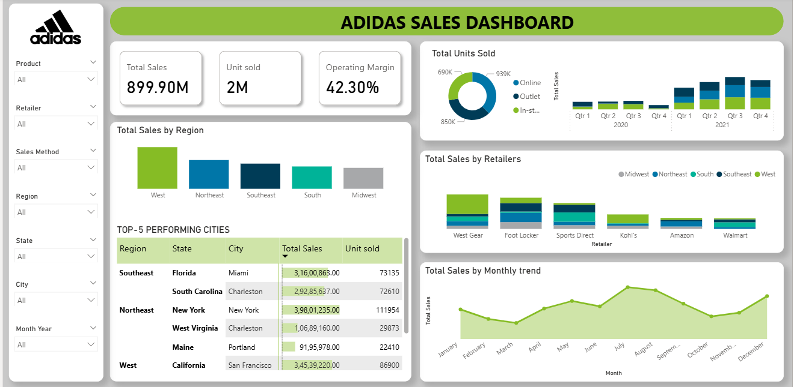
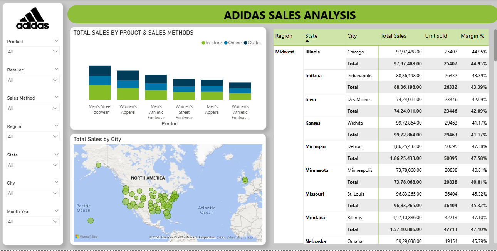

# 📊 Adidas Sales Dashboard – Power BI Project  

## 🔎 Overview  
This project is an **interactive sales dashboard** built in **Power BI** to analyze Adidas’s sales performance across different dimensions.  
The dashboard highlights **key business insights** such as:  
- Total Sales, Units Sold, and Operating Margin  
- Sales distribution by **Region, State, and City**  
- Top 5 performing cities  
- Sales breakdown by **Retailers and Sales Methods (Online, Outlet, In-Store)**  
- Monthly Sales Trends  
- Regional and Product category insights  

This project demonstrates my ability to:  
- Transform raw datasets into actionable insights  
- Build interactive and visually appealing dashboards  
- Apply data storytelling for business decision-making  

---

## 🛠️ Tools Used  
- **Power BI** – Data visualization & dashboarding  
- **Excel/CSV dataset** – Sales dataset for Adidas sales 
- 🔗 [Kaggle dataset link](https://www.kaggle.com/datasets/heemalichaudhari/adidas-sales-dataset)

---

## 📷 Dashboard Preview  
### Main Dashboard  
  

### Regional & Product Insights  
  

## 📂 Project Structure

Adidas-Sales-Dashboard/
│
├── data/               # (Optional) raw dataset if you want to share it
├── pbix/               # Power BI file (.pbix)
├── images/             # Screenshots for README
└── README.md           # Project documentation

---

## 👩‍💻 Author  
**Samiksha Sain**  
🎓 B.Tech CSE Graduate (2025)  
💻 Aspiring **Data Analyst | Python Developer**  
🔗 [Connect with me on LinkedIn](https://www.linkedin.com/in/samiksha-sain/)  

